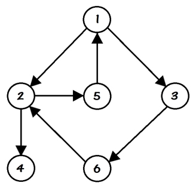

# [Codeforces 1472G](https://codeforces.com/problemset/problem/1472/G)

## 题目大意：

给定一个有向无权图，节点编号从`1`至`n`，设从`1`号节点到第`i`号节点的最短距离为`d[i]`，题目
保证从`1`号节点到任意节点至少存在1条通路。



如图所示，各个节点的`d[i]`值分别为：
- `d[1] = 0 (1)`
- `d[2] = 1 (1 -> 2)`
- `d[3] = 1 (1 -> 3)`
- `d[4] = 2 (1 -> 2 -> 4)`
- `d[5] = 2 (1 -> 2 -> 5)`
- `d[6] = 2 (1 -> 3 -> 6)`

对图中任意一条边`i -> j`，定义`i -> j`为负向边，若`d[i] >= d[j]`（即离`1`号节点较远的点
到离`1`号节点较近的点所构成的边）。

对每个节点`i`，现求`f[i]`为：从`i`点出发，经**至多一条**负向边，能达到的离`1`的最近距离。

因而对上述样例，其`f[i]`值分别为（其中负向边用`=>`标记）：
- `f[1] = 0 = d[1] (1)`
- `f[2] = 0 = d[1] (2 -> 5 => 1)`
- `f[3] = 1 = d[3] (3)`
- `f[4] = 2 = d[4] (4)`
- `f[5] = 2 = d[1] (5 => 1)`
- `f[6] = 1 = d[2] (6 => 2)`

## 解题思路

首先第一步求出所有节点的`d[i]`值，直接广度优先遍历即可。

接下来考虑`f[i]`的含义：即最多使用一条负向边的情况下，所能达到的最小`d`值。

由于正向边只能增大`d`值，只有负向边能减小`d`值，因此达到最小`d`值的方式只能是通过若干正向边
达到某一节点后，再通过最后一条负向边实现`d`值的跳进（减少）。

用动态规划的思路考虑，则可以写出以下转移方程：
```
f[i] = min{
    d[i],   // 原地不动的d值
    min j in (i -> j) {
        f[j], if d[i] <  d[j]; // (i -> j)为正向边，因此走到j后还可以继续使用一条负向边
        d[j], if d[i] >= d[j]; // (i => j)为负向边，因此走到j后不可再使用负向边，距离已达最小值
    }
)
```

由于以上动态转移方程是在树形结构上，迭代的方式不易确定拓扑顺序，因此采用记忆化搜索比较合适。